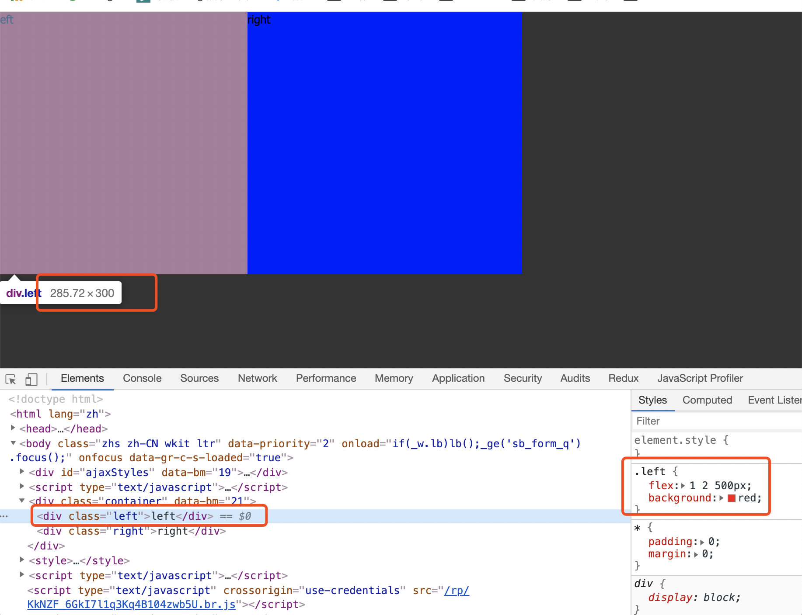
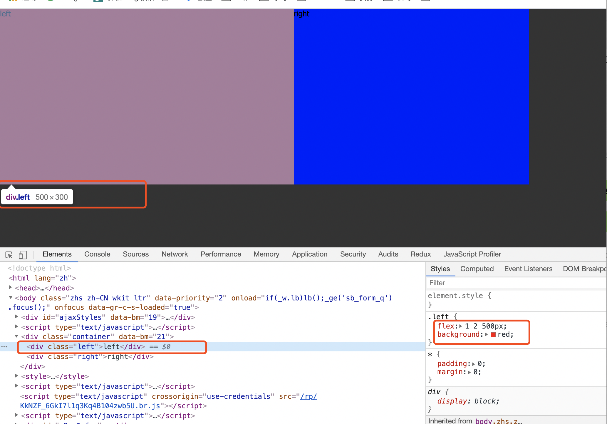
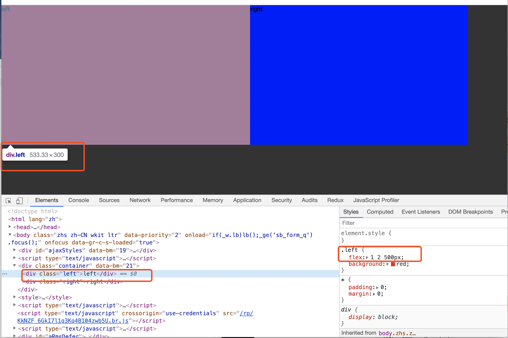

## 前言
在看一篇[ 木易杨大佬，三年前端寒冬入大厂，收获蚂蚁、字节 offer 面经分享](https://mp.weixin.qq.com/s/CFoTRNDXHbqenmW7jFVczg)的文章，其中一道字节跳动的CSS题目吸引了我（哈哈，因为我对这个知识点比较含糊，答不上来），下面我们大家就一起来看看这道题吧。
## 题目
###  求最终 left、right 的宽度（container 的 width < left 的 width + right 的 width 的情况）
```
<div class="container">
    <div class="left"></div>
    <div class="right"></div>
</div>

<style>
  * {
    padding: 0;
    margin: 0;
  }
  .container {
    width: 600px;
    height: 300px;
    display: flex;
  }
  .left {
    flex: 1 2 500px;
    background: red;
  }
  .right {
    flex: 2 1 400px;
    background: blue;
  }
</style>
```
###  先补充下理论知识
首先我们还是看一下，[flex属性的定义](https://developer.mozilla.org/en-US/docs/Web/CSS/flex)吧!
```
The flex CSS property sets how a flex item will grow or shrink to fit the space available in its flex container.
It is a shorthand for flex-grow, flex-shrink, and flex-basis.
```
flex属性其实是flex-grow（主轴空间多余时放大比例）、flex-shrink（主轴空间不足时缩小比例）、flex-basis（分配多余空间之前占据的主轴空间）这三个属性的简写。<br>
flex虽说时前面提到的三个属性的简写，但在一些情况下是可以省略的。
> flex 
单值语法: 值必须为以下其中之一:
一个无单位数(number): 它会被当作 flex-grow 的值。
一个有效的宽度(width)值: 它会被当作 flex-basis 的值。
关键字none，auto或initial.
双值语法: 第一个值必须为一个无单位数，并且它会被当作 flex-grow 的值。第二个值必须为以下之一：
一个无单位数：它会被当作 flex-shrink 的值。
一个有效的宽度值: 它会被当作 flex-basis 的值。
三值语法:
第一个值必须为一个无单位数，并且它会被当作 flex-grow 的值。
第二个值必须为一个无单位数，并且它会被当作  flex-shrink 的值。
第三个值必须为一个有效的宽度值， 并且它会被当作 flex-basis 的值。

上面提到的有效的宽度值，其实就是 number + unit，如 3px、 5rem等。
###  解题
首先，left 的 flow-basis 为 500px，right 的 flow-basis 为 400px，两者之后大于 container 容器的宽度 600px，这时肯定会触发 left 和 right 的压缩来适应容器的宽度，但如何分配压缩比的呢？<br>
left 的 width + right 的 width = container 的 width，这个公式肯定成立。<br>
但为题是 left 的 width 和 right 的 width 如何表示呢？<br>
用数学的用法来解答，假设缩放基数为 x。
```
500*(1-2/x) + 400*(1-1/x) = 600
求解，x = 14/3
```
现在答案出来了，left 的 width 约为 285.72px，right 的 width 约为 314.28px。


###  这里顺便验证下 container 的 width = left 的 width + right 的 width
```
<div class="container">
    <div class="left"></div>
    <div class="right"></div>
</div>

<style>
  * {
    padding: 0;
    margin: 0;
  }
  .container {
    width: 900px;
    height: 300px;
    display: flex;
  }
  .left {
    flex: 1 2 500px;
    background: red;
  }
  .right {
    flex: 2 1 400px;
    background: blue;
  }
</style>
```
结果符合预期，当container 的 width = left 的 width + right 的 width，直接按各个 flex item 的 flow-basis 展示就好。


###  这里顺便验证下 container 的 width > left 的 width + right 的 width
```
<div class="container">
    <div class="left"></div>
    <div class="right"></div>
</div>

<style>
  * {
    padding: 0;
    margin: 0;
  }
  .container {
    width: 1000px;
    height: 300px;
    display: flex;
  }
  .left {
    flex: 1 2 500px;
    background: red;
  }
  .right {
    flex: 2 1 400px;
    background: blue;
  }
</style>
```
这种情况也比较简单，可以这样理解，left 和 right 按 flow-basis 分配，还剩下 100px，则将起分为 left 的 flex-grow + right 的 flex-grow 份，然后 left 占 自己的 flex-grow 份。
```
// left 的 width
left的width = 500 + (1/3)*100 = 533.33px
right的width = 400 + (2/3)*100 = 466.67px
```


> 参考文档
[三年前端寒冬入大厂，收获蚂蚁、字节 offer 面经分享](https://mp.weixin.qq.com/s/CFoTRNDXHbqenmW7jFVczg)
[CSS flex 属性](https://developer.mozilla.org/en-US/docs/Web/CSS/flex)


