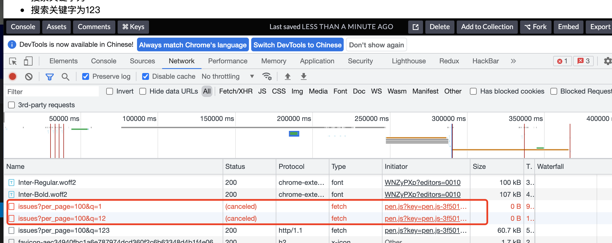

# 前言

一个组件或者页面有一个搜索框和一个显示搜索结果的列表，在用户输入文字的时候能够在列表中展示搜索相关的信息。这个业务场景应该很多同学都做过，今天笔者就带着大家来逐步优化这种业务场景。本文建议在 PC 端上浏览，笔者已经为大家准备好了 demo，观众老爷们可以点开后续章节的的 demo 🔗进行调试。
首先有几个要求：

1.  即时响应用户输入
2.  尽量快速显示用户搜索相关的列表
3.  页面流程、性能尽可能高
4.  需要减少不必要的请求
5.  需要考虑请求异步时序问题

# 简单完成业务

首先第一版先完成业务，我以 react 为列

```
import {useState} from 'react';

function FirstDemo() {
  // const [inputText, setInputText] = useState('');
  const [list, setList] = useState([]);

  const onChange = (e) => {
    console.log('onInput')
    fetch(`${api}&q=${e.target.value}`)
      .then(async res => {
        let result = await res.json();
        setList(Array.isArray(result) ? result : []);
      })
      .catch(e => {
      console.log(e)
    })
  }

  return <div className="box">
    <div className="search-bar">
      请输入你要搜索的仓库名：
      <input 
        onChange={onChange} 
      /></div>
    <ul className="list-box">
      {list?.map((v, i) => {
        return <li>{v.name}</li>
      })}
    </ul>
  </div>
}
```
好的，第一版[demo1](https://codepen.io/fanerge/pen/gOGKQoG)我们已经完成，我们来看看有哪些问题？

# 防抖优化版本

想一想这种场景，当用户快速输入时，在一个单词或一个词组没有输完其实可以不调 api 进行请求，有同学可能会想到 防抖、节流 来优化服务调用频次，当然个人认为在这里使用防抖更合适，防抖的间隔取多少合适呢？在不影响用户体验的情况下，一般 30-100 ms 我觉得都比较合理，好了，这种优化方式大家应该都用过，这里就不做代码演示了。

# 优化中、日、韩文本输入

我们看下需求“要即时响应用户搜索”，需要为搜索框绑定哪些事件呢？原生的 onchange 、oninput 作为了备选项，他们执行的时机略有差异,大家可以在 [MDN](https://developer.mozilla.org/) 上查看区别。对于使用 React 的用户，React 已经封装了原生事件，保证 onChange 事件能够在合适的时机触发。但你试着输入 CJK(中文、日文、韩文) 文本呢？会发生什么？我们在输入一些合成文本时会使得情况变得复杂起来，你切换到中文输入法时，试着输入"zhongguo"，你会发现还没有输入"中国"时已经就调了 8 次无效的 api，为什么说是无效的呢，我认为这些中间搜索结果其实用户并不关心，反而觉得这是 bug。

```
const onCompositionStart = (e) => {
    console.log('onCompositionStart');
  }
  const onCompositionUpdate = (e) => {
    console.log('onCompositionUpdate');
  }
  const onCompositionEnd = (e) => {
    console.log('onCompositionEnd');
  }

  return <div className="box">
    <div className="search-bar">
      <input
        onChange={onChange}
        onCompositionStart={onCompositionStart}
        onCompositionUpdate={onCompositionUpdate}
        onCompositionEnd={onCompositionEnd}
      /></div>
    <ul className="list-box">
      {list?.map((v, i) => {
        return <li>{v.text}</li>
      })}
    </ul>
  </div>
```

我先在代码中添加 onCompositionStart、onCompositionUpdate、onCompositionEnd 事件，你可以在[demo2](https://codepen.io/fanerge/pen/vYerQdm)中测试输入非 CJK 和 CJK 文本时控制台打印出的日志。

我们可以利用输入非 CJK 文本时只会执行 onInput 事件，输入 CJK 文本时会依次执行
onCompositionStart、(onCompositionUpdate、onInput 持续输入会是一个重复的过程)、最后我们选择待选文本后执行 onCompositionEnd 事件。通过上面测试，对于用户输入 CJK 文本时我们事件应该在 onCompositionEnd 中执行呢？
代码实现

```
function SearchDemo() {
  const isCompositionRef = useRef(false);
  const [list, setList] = useState([]);

  const getData = (e) => {
    fetch(`${api}&q=${e.target.value}`)
      .then(res => {
      console.log(res);
      // setList(res?.data || []);
      })
      .catch(e => {
      console.log(e)
    })
  }
  const onChange = (e) => {
    // 输入为 CJK 不执行 getData
    if(isCompositionRef.current) return;
    getData(e)
  }
  const onCompositionStart = (e) => {
    isCompositionRef.current = true;
  }
  const onCompositionEnd = (e) => {
    isCompositionRef.current = false;
    getData(e)
  }

  return <div className="box">
    <div className="search-bar">
      <input
        onChange={onChange}
        onCompositionStart={onCompositionStart}
        onCompositionEnd={onCompositionEnd}
      /></div>
    <ul className="list-box">
      {list?.map((v, i) => {
        return <li>{v.text}</li>
      })}
    </ul>
  </div>
}
```

现在我们的代码已经优化了这种场景，你可以试试看。[demo3](https://codepen.io/fanerge/pen/NWazEzL)

这种优化方案我也在 element-ui 的 [el-input](https://github.com/ElemeFE/element/blob/dev/packages/input/src/input.vue) 源码中看到过。当然 CompositionEvent 表示用户间接输入文本（如使用输入法）时发生的事件，还支持语音输入等，大家可以自己去探索下。

# 虚拟滚动列表优化数据量大的情形

现在我们需要考虑 api 返回的数据特别大，list 10000 条以上，在启用 React fiber （React Concurrent Features） 特性之前，React 可能会长时间占用 js 线程，用户输入的数据无法及时在 input 中反馈，你可以使用新版 React 和 ReactDOM 来缓解这个问题，这种使用方式也比较简单，就不做代码演示。
我们看下另一种方案，虚拟化列表滚动方案，本质上就是无论数据多少，我们只显示容器内或 viewport 内的条目即可，用户滚动时在动态变更容器内显示的数据。知乎-饿了么团队有篇文章介绍虚拟列表实现原理挺不错，推荐大家阅读[再谈前端虚拟列表的实现](https://zhuanlan.zhihu.com/p/34585166)。在这里我推荐一个组件 [react-tiny-virtual-list](https://www.npmjs.com/package/react-tiny-virtual-list)，gzip 后大小只有 3kb，作者考虑了很多东西，如列表中项目高度一致、高度不一致情况、自定义容器不可见区域的 buffer（解决滑太快会看见页面空白的现象），[作者做了很多demo](https://clauderic.github.io/react-tiny-virtual-list)，大家可以去试试，在这里就不做代码演示了。

# 优化异步请求时序问题

由于 internet 是一个大型的网状结构，我们在频繁向后端发送请求的情况下，很有可能每次请求所选择的路径不相同（路由和寻址）以及一些其他原因，导致先发出的请求后接收到响应。如果浏览器发出了两个请求 1，2 ，浏览器却先收到请求 2 的响应并绘制到浏览器中，然后再接收到请求 1 的响应并绘制到浏览器中，这里如果 1 和 2 搜索的关键字不同就会导致 bug（搜索关键字和查询结果不一致）。

```
function SearchDemo() {
  // fetch 返回 promise，只保存最后一个 promise
  const lastPromise = useRef();
  const [list, setList] = useState([]);

  const getData = (e) => {
    const currentPromise = fetch(`${api}&q=${e.target.value}`)
    lastPromise.current = currentPromise
    // 过滤掉不是最后一次发起的请求
    currentPromise.then(
      res => {
        if (currentPromise === lastPromise.current) {
          setList(res?.data || []);
        }
      },
      e => {
        if (currentPromise === lastPromise.current) {
          console.warn('fetch failure', e);
        }
      },
    );
  }
  const onChange = (e) => {
    getData(e)
  }

  return <div className="box">
    <div className="search-bar">
      <input
        onChange={onChange}
      /></div>
    <ul className="list-box">
      {list?.map((v, i) => {
        return <li>{v.text}</li>
      })}
    </ul>
  </div>
}
```

[demo4](https://codepen.io/fanerge/pen/qBPKgBy)这里技巧性比较强，利用 fetch 方法每次返回不同的 Promise 对象内存地址，并始终只记录最后一次的 Promise 对象内存地址，在接收到响应时判断并只处理最后一个请求的响应。思想最初来源于[Handling API request race conditions in React](https://sebastienlorber.com/handling-api-request-race-conditions-in-react)

# 另一种方案优化异步请求时序问题

[Handling API request race conditions in React](https://sebastienlorber.com/handling-api-request-race-conditions-in-react)文章还提供了一个思路取消之前的所有请求，这里还有个好处，如果提前取消请求，浏览器就会省略解析 Response 这一过程，前面一种方式浏览器其实是解析了 Response ，只是我们没有用到而已[demo5](https://codepen.io/fanerge/pen/WNZyPXp)。
代码如下：

```
function SearchDemo() {
  const isCompositionRef = useRef(false);
  const [list, setList] = useState([]);
  const [text, setText] = useState([]);

  const onChange = (e) => {
    // 输入为 CJK 不执行 getData
    if(isCompositionRef.current) return;
    setText(e?.target?.value);
  }
  const onCompositionStart = (e) => {
    isCompositionRef.current = true;
  }
  const onCompositionEnd = (e) => {
    isCompositionRef.current = false;
    setText(e?.target?.value);
  }

  useEffect(() => {
    setList([]);
    // Create the current request's abort controller
    const abortController = new AbortController();
    // Issue the request
    fetch(`${api}&q=${e.target.value}`, {
      signal: abortController.signal,
    })
      .then(res => {
        // IMPORTANT: we still need to filter the results here,
        // in case abortion happens during the delay.
        // In real apps, abortion could happen when you are parsing the json,
        // with code like "fetch().then(res => res.json())"
        // but also any other async then() you execute after the fetch
        if (abortController.signal.aborted) {
          return;
        }
        setList(res?.data || []);
      })
      .catch(e => {
      console.log(e)
    })
    // Trigger the abortion in useEffect's cleanup function
    return () => {
      abortController.abort();
    };
  }, [text]);

  return <div className="box">
    <div className="search-bar">
      <input
        onChange={onChange}
        onCompositionStart={onCompositionStart}
        onCompositionEnd={onCompositionEnd}
      /></div>
    <ul className="list-box">
      {list?.map((v, i) => {
        return <li>{v.text}</li>
      })}
    </ul>
  </div>
}
```

比如你快速输入"123"将在控制台看见如下效果：


# 结尾

“搜索列表“只是一个小小的业务场景，如果你想去优化总是有些突破口。但笔者想说的，我们开发也需要考虑开发成本和收益，对于收益和开发成本不对等的情况下大家也没必要做这么多优化（又不是不能用），也比较反对“过早优化”。

本文也是 2022 年的第一篇文章，祝大家能够在新的一年里“升职加薪、早日实现财务自由”。如果本文对你有帮助请你点击“关注”和“点赞”就是对我的支持，谢谢。
欢迎转载 请注明出处

> 参考文档：
> [再谈前端虚拟列表的实现](https://zhuanlan.zhihu.com/p/34585166) 
> [Handling API request race conditions in React](https://sebastienlorber.com/handling-api-request-race-conditions-in-react) 
> [react-tiny-virtual-list](https://www.npmjs.com/package/react-tiny-virtual-list)
